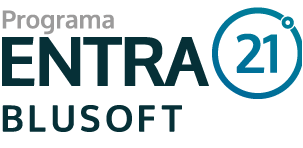

  
  <h1>Edição 2018 | Desenvolvimento Java</h1>

<h3 align="center">
  Códigos Desenvolvidos
</h3>

  

  

  <a href="#pushpin-info">Info</a>&nbsp;&nbsp;&nbsp;|&nbsp;&nbsp;&nbsp;
  <a href="https://github.com/gabrielbudke/entra21/tree/master/src/br/com/entra21/exemplos">Exemplos</a>&nbsp;&nbsp;&nbsp;|&nbsp;&nbsp;&nbsp;
  <a href="https://github.com/gabrielbudke/entra21/tree/master/src/br/com/entra21/exercicios">Exercícios</a>

## :pushpin: Info

Este respositório contém os códigos desenvolvidos durante a minha participação no programa Entra21 da edição 2018.

Foi no Entra21 que tive meu primeiro contato com com programação. Sendo assim os códigos possuem um nível iniciante e com objetivos de aprendizado.

## Exercícios

- [Solicitação de Informação](https://github.com/gabrielbudke/entra21/tree/master/src/br/com/entra21/exercicios/lista01)
- [Estrutura Condicional](https://github.com/gabrielbudke/entra21/tree/master/src/br/com/entra21/exercicios/lista02)
- [Estrutura de Repetição - While](https://github.com/gabrielbudke/entra21/tree/master/src/br/com/entra21/exercicios/lista03)
- [Vetor](https://github.com/gabrielbudke/entra21/tree/master/src/br/com/entra21/exercicios/lista04)
- [Estrutura de Repetição - For](https://github.com/gabrielbudke/entra21/tree/master/src/br/com/entra21/exercicios/lista05)

---
Feito by Gabriel Sousa
